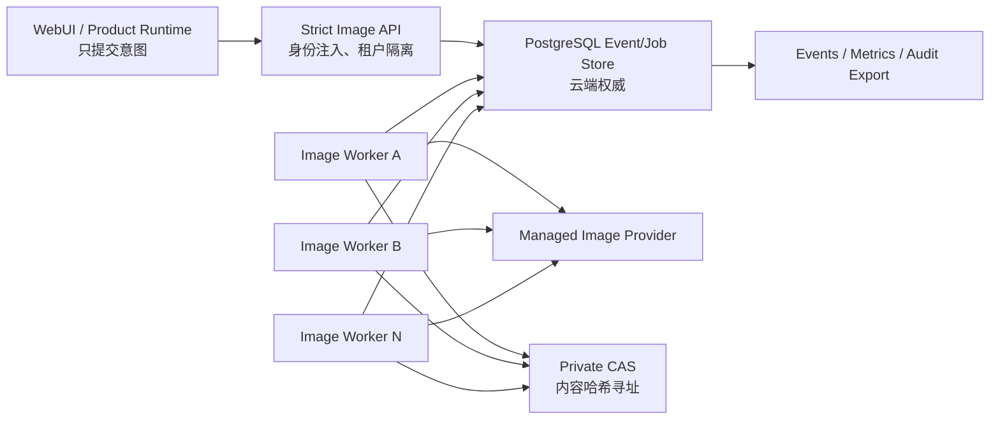

# EcoreX v1.0 图像高并发编排架构与开发留痕

> 状态：核心域、Product Runtime、imagegen Capability Pack 与结构化 Retouch 执行链已接通。
> 实现日期：2026-07-10
> 代码边界：`ecorex/image_orchestrator/`
> 回归证据：`python -m pytest -q tests/v1/test_image_orchestrator.py`

## 1. 产品边界与权威归属

图像生成和精准修图都被建模为云端权威的 Durable Image Job。WebUI 只能提交意图和映射状态，不能自行决定并发、重试、账户归属、provider 幂等键或结果是否可见。

产品接入后仍保持单一运行权威：

- imagegen 与精准修图共享一个 `ManagedImageOrchestrationClient`，只能访问签名配置中固定的 `/api/v1/images`。
- 客户端将账户、session generation、lease digest 和 revision 绑定为不可变连接栅栏；任一值变化均终止请求。
- 结构化 Retouch 通过单向适配器映射为一个云端 Job；`edit_surface` 和 mask 证据保持结构化，不由前端拼 prompt。
- 云端完成后先持久化 `job_id + result.sha256` 承诺，再创建 Artifact。崩溃恢复只完成本地发布，不重复调 provider。
- 旧 Python imagegen/Retouch runner 不进入 v1 Product wheel；旧 multipart/base64 同步 Retouch adapter 已从 v1 源码和 exports 删除，Product composition 中不存在第二执行所有者。

## 2. 运行拓扑



- PostgreSQL 适配器是云端横向扩展实现。
- SQLite WAL 适配器是可移植的正确性参考、单机开发和故障注入载体，不是多节点云端数据库。
- provider 密钥不进入 Job、checkpoint 或 event，只由 Worker 运行环境注入。
- CAS 先写入内容哈希对象，再在数据库中原子发布结果。数据库失败时最多留下可回收的未引用 CAS blob，不会出现可见的半提交结果。

## 3. 状态机与不变式

```text
accepted → queued → leased → running → verifying → committing → completed
                    └───────────────────────────────→ retry_wait → leased
                                                           └→ dead_letter
任意非终态 → cancelled
不可恢复/超时 → failed
```

核心不变式：

1. `(account_id, client_request_id)` 唯一。相同请求指纹返回原 Job，不同指纹返回 409，不允许覆盖。
2. provider 幂等键从不可变 `job_id` 派生，同一 Job 的所有重试与恢复始终相同。
3. 任何执行写入必须携带当前 `lease_token`。token 内含单调增长的 `lease_generation`，数据库还会同时校验状态、租约时间和 Job deadline。
4. 旧 Worker 的 heartbeat、状态迁移和结果提交在租约过期、取消或新一代租约生效后一律失败。
5. `image_results` 、`image_usage` 和 `image_events` 不可更新/删除；Job 转 `completed`、结果、usage 与 completed event 在一个数据库事务中提交。
6. 事件先写数据库。事件不允许提示词、图像二进制、文件路径、token、secret 或 API key。
7. 取消是数据库权威终态。provider cancel 仅是尽力而为，即使 provider 稍后返回结果，fencing 也会拒绝它。

## 4. 公平调度、并发与背压

### 4.1 工作量权重

```text
weight = ceil(megapixels) × count × operation_weight × model_weight
operation_weight: generate=1, retouch=2
```

model weight 是服务端配置，用于反映不同模型的显存/算力差异。客户端不能提交 weight。

### 4.2 加权公平队列

每个账户维护一个虚拟完成时间 `last_finish`。新 Job 的 `fair_finish` 由账户虚拟时间和当前队列基线取大后加 weight。租约时优先选择 `fair_finish` 最小的 Job，然后才比较显式 priority 和创建时间。这避免一个大租户先填满队列就长时间阻塞后到小租户。

### 4.3 并发上限

数据库在租约事务内同时校验：

- 全局 running 上限；
- 单账户 running 上限；
- 单模型 running 上限；
- generate/retouch 操作类型 running 上限。

PostgreSQL 使用 scheduler control row 保护上限判定，候选 Job 使用 `FOR UPDATE SKIP LOCKED`。因此多个进程/多个节点可以并发抢占，但不会超卖配额或同时租出同一 Job。

### 4.4 提交背压

接收新 Job 时检查全局/单账户的 Job 数和加权队列容量。超限返回 HTTP 429 及 `Retry-After`，不在内存中无限堆积。容量在数据库中计算，服务重启后仍然生效。

## 5. provider 不确定性恢复

外部调用最危险的窗口是：provider 已接收请求，但 Worker 在收到响应前断线或崩溃。直接重发可能重复生图和重复计费。

实现流程：

1. 调 provider 之前，Worker 先将 `provider_started=true` checkpoint 与 `running` 状态持久化。
2. 对 provider 的首次调用使用稳定 `provider_idempotency_key`。
3. 如果返回 pending，持久化 `provider_request_id`。
4. 租约超时或响应不确定时，checkpoint 标记 `provider_uncertain=true`。
5. 下一次执行必须先调 `recover(idempotency_key, provider_request_id)`。
6. recover 返回 completed 就验证与提交；返回 pending 继续等待；只有明确 `not_found` 才允许再次 submit，且仍使用原幂等键。

## 6. 重试、熔断和死信

| 错误类型 | 处理 |
|---|---|
| provider 429 / rate limited | 指数退避 + jitter，保留幂等键 |
| provider 5xx / unavailable / timeout | 标记结果不确定，恢复优先 |
| provider OOM / 本地 `MemoryError` | 可重试，计入熔断器 |
| 响应丢失 / 未知异常 | 不盲目重发，下次先 recover |
| provider 明确拒绝 | 立即 failed，不自动重试 |
| 超过 max attempts/deadline | dead_letter 或 failed |

熔断粒度是 `provider/model/operation/size_class`，状态持久化在数据库中，不会因某个 Worker 重启而清零。达到阈值后的 Job 直接进入 retry wait，不继续冲击 provider。

dead letter 只能用带 `recovery_request_id` 的显式恢复操作重排。恢复请求本身也幂等且不可变，同一 recovery ID 不能用于另一 Job。

## 7. 结果验证与 CAS

provider 返回的结果在进入 CAS 前必须通过：

- 最大 256 MiB 尺寸限制；
- SHA-256 commitment 比对（provider 提供时）；
- PNG/JPEG/WebP/AVIF 的 MIME 白名单和文件魔数匹配；
- CAS 目录、现有 blob 必须是非链接、非 reparse point 的安全普通文件；
- 写入采用同目录临时文件、`fsync` 和原子替换；
- 读取时重新校验 inode/file identity、大小和 SHA-256。

云端部署时 CAS root 必须位于所有 Worker 可见的私有持久卷，或由同等的对象存储适配实现。不能使用会随 Pod 销毁的本地临时目录。

## 8. API 合同

API 前缀：`/api/v1/images`

| 方法 | 路径 | 用途 |
|---|---|---|
| POST | `/jobs` | 幂等提交 generate/retouch Job |
| PUT | `/inputs/{sha256}` | 上传并按当前租户登记私有输入 CAS |
| GET | `/jobs/{job_id}` | 获取当前租户的 Job 投影 |
| GET | `/jobs/{job_id}/result` | 仅下载当前租户已完成 Job 的校验结果 |
| POST | `/jobs/{job_id}/cancel` | 权威取消 |
| POST | `/jobs/{job_id}/recover` | 回收过期租约/显式重排死信 |
| GET | `/metrics` | 获取当前租户的队列与 usage 指标 |

安全规则：

- `account_id` 只从 FastAPI 注入的已认证 principal 获取，不在任何 body 中接受。
- 查询其他租户 Job 一律返回 404，不暴露资源是否存在。
- Pydantic 使用 strict + `extra=forbid`。未知字段、类型弱转换、非 8 对齐尺寸等均被拒绝。
- 422 响应只返回错误字段位置，不回显 prompt 或 metadata 原值。
- 公开投影不返回 prompt、provider 幂等键、lease token、checkpoint 或内部路径。

## 9. 可观测性

已提供按 Job 排序的 append-only event，包含 accepted、queued、leased、heartbeat、running、verifying、committing、retry/dead-letter/reclaim/cancel/complete。

已提供按租户或全局统计的：

- queued / retry wait / active / completed / failed / cancelled / dead letter；
- queued weight；
- oldest queued seconds；
- 已原子提交的 billed units。

生产监控建议设置：

- 队列最老等待时间和租户公平性告警；
- 过期租约回收率；
- provider uncertainty recover 成功率；
- provider 粒度熔断状态；
- dead-letter 增长率；
- 结果验证失败率；
- 从 accepted 到 completed 的 p50/p95/p99。

## 10. PostgreSQL 部署要求

- 生产使用 PostgreSQL 15+。
- `psycopg` 是云端 Worker/API 镜像的可选依赖；本地 Runtime 不因导入图像域而强制安装它。
- 表结构 SQL 由适配器提供为参考初始化合同。正式发布时必须放入受版本控制的 Control Plane migration，不在多个 Pod 启动时同时执行 DDL。
- API 和 Worker 共享同一个数据库权威源。不允许 Worker 使用本地 SQLite 而 API 使用 PostgreSQL。
- Worker 为无状态水平扩展。扩容不改变租约、上限或公平性语义。
- 调整 Worker 数前先调整数据库连接池和 provider 配额；Worker 数不是突破数据库并发限制的手段。

## 11. 验证留痕

2026-07-10 自动化覆盖：

1. 128 个线程使用同一 client request key 并发提交，只产生一个 Job 和一组 accepted/queued event。
2. 同 key 不同指纹冲突。
3. 大租户先入队时，后到租户仍在前三次租约中获得执行。
4. 队列背压跨 SQLite 重启仍有效。
5. 租约过期回收、provider uncertainty checkpoint 和旧 token fencing。
6. provider 已接收但响应丢失时，重启后 recover，submit 仅一次、usage 仅一次。
7. provider pending request ID 跨重试/重启保存。
8. unavailable 重试、持久化熔断、dead letter 与幂等 requeue。
9. 在 atomic commit 前注入崩溃，result/usage/completed event 全部回滚，恢复后可只提交一次。
10. 取消后的迟到结果被 fencing 拒绝。
11. MIME 伪装被 CAS 拒绝，合法内容重读时校验 digest。
12. API 幂等返回、严格字段、不回显 prompt 和跨租户 404。
13. PostgreSQL 适配器无强制 `psycopg` 导入，Store Protocol 完整，租约 SQL 包含 `FOR UPDATE SKIP LOCKED`。

当次结果：`13 passed`。
后续租户输入 CAS/结果下载合同纳入核心套件后，根级复验为 `14 passed`。

Product 接入后新增覆盖：租户输入 CAS 栅栏和结果下载、客户端 digest/MIME/ETag/
size 四重校验、Managed Session 切换栅栏、重启先 recover、generate/retouch 共享调度、
surface/mask 结构化映射、Artifact 发布崩溃窗口与真实 Capability Pack handler 绑定。
聚焦命令见 `docs/v1.0/verification-ledger.md` 的“Unified managed image Product execution”。

2026-07-12 又完成真实共享存储的限界故障钻演：PostgreSQL 16.9 与 MinIO
均按容器 digest 固定，256 个唯一 Job、48 个并发 Worker 和 16 个重复提交
全部 exactly-once 完成，只保留一个共享结果 blob 且引用完整。钻演同时覆盖过期
lease/旧 token fencing、MinIO 进程暂停后 fail-closed 与恢复、PostgreSQL 进程重启
后的 attempt-2 回收，以及 ETag+tombstone 条件 GC。完整机器证据为
`docs/v1.0/evidence/image-shared-storage-real-2026-07-11.json`。

这项证据是约两分钟的 Windows/Docker loopback 有界负载，不替代 24 小时以上的
多节点 soak、生产 HTTPS/private-bucket/KMS、真实托管 Provider 计费去重和跨区
数据库/对象存储故障演练。

## 12. Product/Retouch 接入检查表

- [x] Product Runtime 只通过云端 `ImageOrchestrationService/API` 提交，不并行启动旧 imagegen/retouch runner。
- [x] 本地恢复索引只保存账户、client request、指纹、Job ID 和状态，不保存 prompt、图像字节或路径。
- [x] generate 和 retouch 共用 Job 调度，retouch 的输入只传租户登记的 CAS SHA-256，不传本地路径。
- [x] Job completed 后先分阶段持久化云端承诺，再由单一 Publisher 创建带 lineage 的 Artifact 和行内 Item。
- [x] `(account_id, cloud_job_id, result.sha256)` 具有本地唯一约束；Artifact 发布失败只恢复或重试发布，不重新调 provider。
- [x] 本地 Publisher 在云轮询、结果 staging 和 Artifact CAS 期间持续心跳续租；旧 token 丢失后不能发布。
- [x] 前端展示服务端 Job/Artifact 投影，不从本地临时状态推断完成。
- [x] 签名 image Capability Pack 只绑定产品内置 handler；缺失 Pack 或云端配置时返回稳定 disabled reason，禁止新旧双执行。
- [x] 真实 PostgreSQL+MinIO 已完成 256 Job/48 Worker/重复提交/进程故障的
  有界钻演，不再只以 SQLite 并发测试代替共享存储验证。
- [ ] 生产拓扑继续完成多节点 24 小时 soak、跨区/网络分区与托管备份恢复。
- [ ] 对象存储/共享 CAS、KMS、数据库备份与数据保留策略在上线前配置完成。

## 13. 2026-07-12 独立并发稳定性复审

本次复审没有更换状态机或扩大执行边界，而是闭合了四个在高并发/
故障窗口中才会显现的缺口：

1. `queued/retry_wait` 超过 deadline 后不再只是被租约查询忽略。
   SQLite 和 PostgreSQL 现在都在 submit/lease/reclaim 事务内将其
   幂等转为 `failed/deadline_exceeded`，追加唯一终态事件，并立即
   释放持久化背压容量。PostgreSQL 候选行使用
   `FOR UPDATE SKIP LOCKED`，且与全局 scheduler control lock 协同。
2. 托管 Provider 的 `Retry-After` 同时支持 delta-seconds 和 HTTP-date，
   被限制在 1–3600 秒。缺失、畸形或超界值不能制造热重试或
   无界停顿，而是回退到原有指数退避+jitter。初次 submit 的 429
   被视为明确未接纳，下次继续 submit；结果下载阶段的 429
   保留 recover-first 语义。限流不只影响当前 Job：Store 会立即将
   同一 provider/model/operation/size scope 的持久化 `open_until`
   提升到 `max(Retry-After, cooldown policy, existing fence)`，即使尚未
   达到普通失败熔断阈值，其他 Worker 也不再继续冲击 Provider。
3. 熔断冷却到期后不再由所有 Worker 同时探测。第一个 Worker
   在 `image_breakers` 的同一行事务中获得有界 half-open 探针
   租约；其他副本只能持久化退避。探针成功关闭熔断，失败
   重新开启冷却，进程崩溃后也只能在探针租约到期后再探。
4. Provider 完成后的 CAS put/describe/read 阶段现在持续续租。结果
   和 usage 的精确承诺在 `committing` checkpoint 中一起持久化。
   如果数据库在最终原子提交前故障，重启后会重读并校验 CAS，
   直接完成 result/usage/event 事务，不再调用 Provider。无效或
   损坏的 staging 承诺会 fail-closed/转 recover-first，绝不发布未校验字节。

受控验证位于
`tests/v1/test_image_concurrency_stability.py`：32 路过期竞争只产生一个
终态事件；16 个并发 Worker 在 half-open 窗口只有一次假 Provider
调用；慢 CAS 跨过原租约时间仍完成；最终提交注入故障并重启后
`submit=1/recover=0/usage=1/completed_event=1`。这是本地有界、受控的
假 Provider 测试，包括“首个 429 后其余 Job 零 Provider 调用，
窗口到期后仅一个 half-open 探针”；它不是生产 soak，也不代替本文第 12 节保留的
外部门禁。
