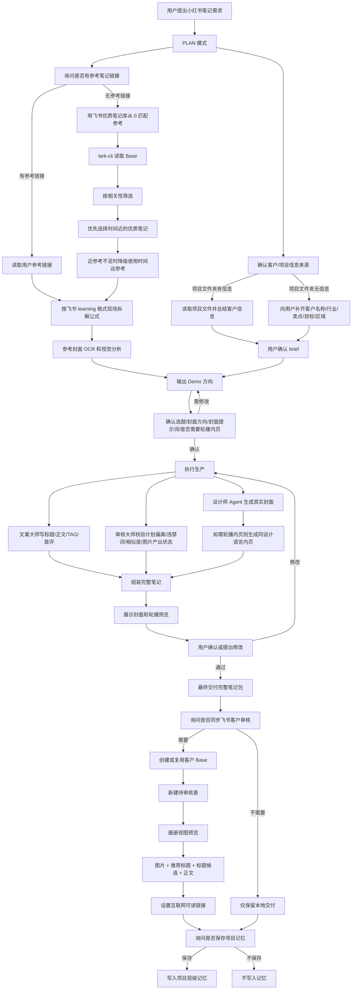

# create-xiaohongshu-note

这个 skill 用于从 0 到 1 生产一整套小红书笔记，不只写文案，而是覆盖选题、参考拆解、封面/轮播图、正文、TAG、首评、审核、飞书客户预览和可选项目记忆。

## 总流程

## 关键规则

- 飞书资料优先走 `lark-cli`，不优先用浏览器自动化。
- 飞书优质笔记库优先参考时间近的笔记；时间近但不匹配时，降级使用时间远但更相关的笔记。
- 参考封面必须做 OCR/视觉分析，检查文字、排版、字体、色彩、元素和相似度。
- 封面必须生成真实图片并给用户预览，不能只给草图或提示词。
- 封面不放 CTA；CTA 可以放在轮播内页、正文、TAG 或首评。
- 标题不超过 20 个字。
- 最终产物包含封面、可选轮播内页、标题、正文、TAG、首评和审核自检。
- 飞书客户审核默认用 `画册` 视图，只展示图片、推荐标题、标题候选、正文。
- 飞书客户审核表不暴露参考链接、封面提示词、内页提示词。
- 用户明确同意后才保存项目记忆。
